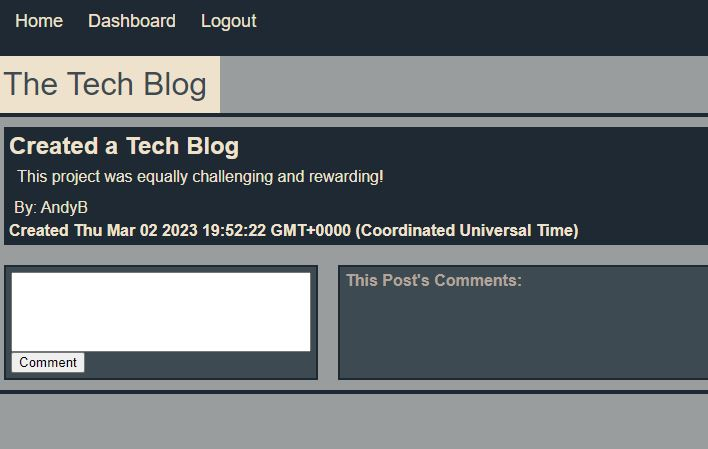

# tech-blog

## Description

- What was your motivation?
  - To build a fullstack blog application
- Why did you build this project?
  - I wanted to get more experience with building backend and frontend logic
- What problem does it solve?
  - The app allows users to create a user account and post blog posts
- What did you learn?
  - I increased my knowledge base on router building, databases, frontend controllers and rendering to handlebars, and just how much effort it takes to build a fully functional website.

## Installation

- Installation not required
- Follow this link: https://tech-blog-wabarringer.herokuapp.com/home

## Usage

- When visiting the site you are directed to the login screen. After signing up you will see the Homepage where all user posts live. You can add posts by navigating to the Dashboard. You'll also see all of your posts under the post form on Dashboard.

- 

## Credits

N/A

## License

N/A
